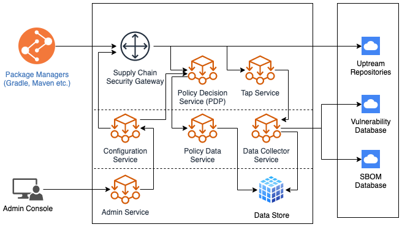
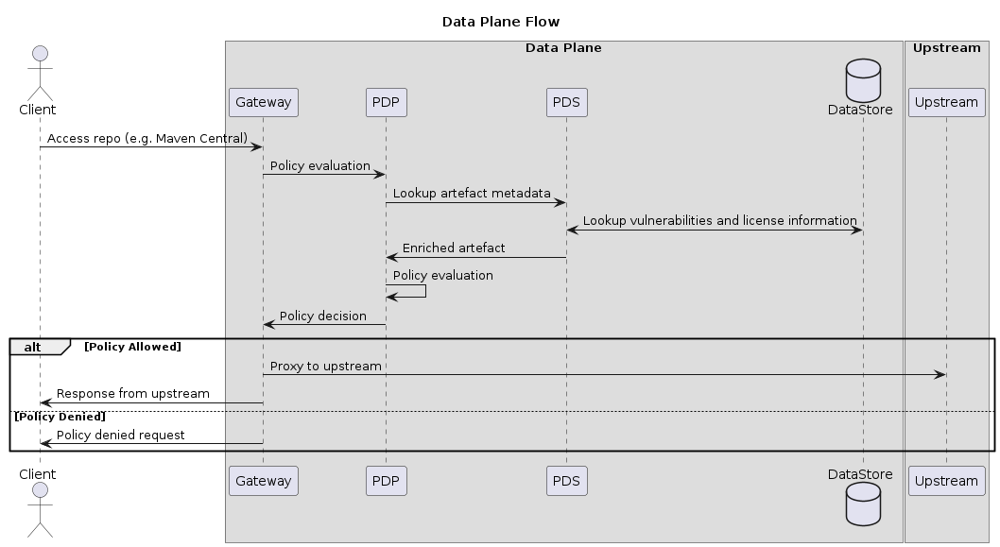

# Supply Chain Security Gateway

A reference architecture and proof of concept implementation of a supply chain security gateway with the goal of enforcing sane security policies to an organization's consumption of 3rd party software in its own products.

## TL;DR

Start the services using `docker-compose`

```bash
docker-compose up -d
```

Verify all the services are active

```bash
docker-compose ps
```

Use the gateway using the `demo-client`

```bash
cd demo-client && ./gradlew assemble --refresh-dependencies
```

At this point, you should see logs generated by gateway and the policy decision service.

```bash
docker-compose logs envoy
docker-compose logs pdp
```

The `gradle` build should fail with an error message indicating a dependency was blocked by the gateway.

```
> Could not resolve all files for configuration ':app:compileClasspath'.
   > Could not resolve org.apache.logging.log4j:log4j:2.16.0.
     Required by:
         project :app
      > Could not resolve org.apache.logging.log4j:log4j:2.16.0.
         > Could not get resource 'http://localhost:10000/maven2/org/apache/logging/log4j/log4j/2.16.0/log4j-2.16.0.pom'.
            > Could not GET 'http://localhost:10000/maven2/org/apache/logging/log4j/log4j/2.16.0/log4j-2.16.0.pom'. Received status code 403 from server: Forbidden
```

> Refer to `policies/example.rego` for the policy that blocked this artefact

## Architecture



### Data Plane Flow



## Usage

If you are developing on any of the service and want to force re-create the containers with updated image:

```bash
docker-compose up --force-recreate --build -d
```

### PDP Development

Build and run the PDP using:

```bash
cd services && make
GLOBAL_CONFIG_PATH=../config/global.yml PDP_POLICY_PATH=../policies ./out/pdp-server
```

PDP listens on `0.0.0.0:9000`. To use the host instance of PDP, edit `config/envoy.yml` and set the address of the `ExtAuthZ` plugin to your host network address.

### Policy Development

Policies are written in [Rego](https://www.openpolicyagent.org/docs/latest/policy-language/) and evaluated with [Open Policy Agent](https://www.openpolicyagent.org/docs/latest/integration/#integrating-with-the-go-api)

To run policy test cases:

```bash
cd policies && make test
```

* Refer to `policies/example.rego` for policy example
* Policies are load from `./policies` directory
