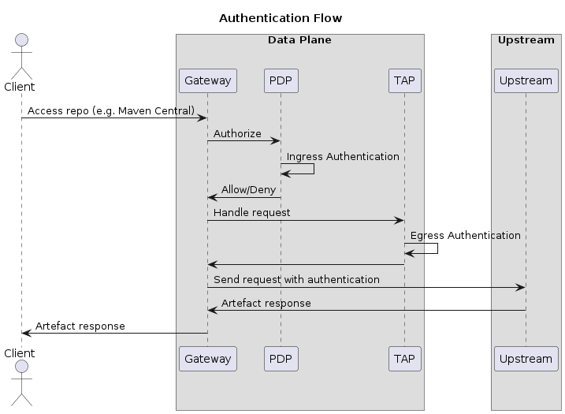

# Gateway Authentication

## Goal

Restrict gateway access to authenticated users only as per configuration.

> **Note:** Gateway authentication is applicable for users trying to access the Gateway. It is not relevant for authentication requirements for upstream repositories. Upstream repositories can have authentication of their own.

## Requirements

- Global authentication across all upstreams / routes in the gateway
- Upstream specific authentication
- Support different types of authentication
  - RelayAuth - Relay the credentials to upstream repository
  - OpenID Connect (OIDC) - To support Github Actions OIDC and equivalent CI integration
  - AWS STS AssumeRole

### Limitation

Basic authentication as the only supported form of supplying credentials, since most package managers use basic authentication to authenticate with repositories.

We will not support fine grained *authorization* because we are in the data plane. We need to be minimalist for low latency and performance. Any need for limited authorization can be handled at policy level.

## Flow

